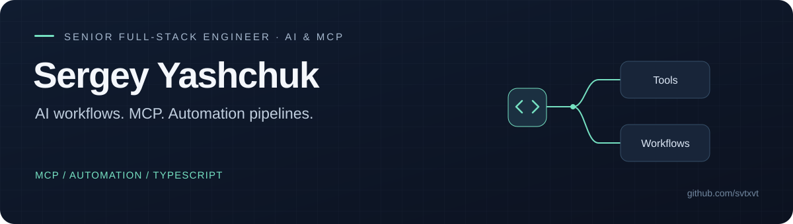

  

I’m **Sergey Yashchuk**, a software engineer building integrations and small tools that solve a specific problem. My public work spans **TypeScript & MCP**, **PHP & WordPress**, and **Kotlin & Android**.

[Explore selected work](PORTFOLIO.md) · [Discuss a project](mailto:sergey.yashchuk1@gmail.com)

## Selected work

### 01 / MCP Lead CRM
**A lead pipeline controlled through an MCP client.**

A local TypeScript server for lead records, follow-ups, CSV import/export and an optional n8n webhook. Includes a recorded demo, fictional seed data and automated tests. The demo works without API keys; its webhook call is a dry run.

[Source & setup](https://github.com/svtxvt/mcp-lead-crm) · [Watch the demo](https://github.com/svtxvt/mcp-lead-crm/blob/main/docs/demo.gif) · [Tests](https://github.com/svtxvt/mcp-lead-crm/tree/main/tests)

### 02 / Simple Outbound Webhooks
**Connect WordPress events to the rest of a workflow.**

A PHP plugin that sends selected post, comment and registration events to HTTPS endpoints. Optional HMAC-SHA256 signatures, a delivery log and a Docker test harness make the integration inspectable.

[Source & setup](https://github.com/svtxvt/simple-outbound-webhooks) · [Verification notes](https://github.com/svtxvt/simple-outbound-webhooks/blob/main/QUALITY-NOTES.md) · [End-to-end check](https://github.com/svtxvt/simple-outbound-webhooks/blob/main/dev/e2e.sh)

### 03 / Android Force 120Hz
**An Android utility for aggressive LTPO refresh-rate downscaling.**

A Kotlin accessibility service uses a small animated overlay to keep display content active. Published APK releases and a demo show the result; device compatibility and battery use remain practical trade-offs.

[Source & demo](https://github.com/svtxvt/android-force-120hz) · [APK releases](https://github.com/svtxvt/android-force-120hz/releases)

## Work with me

I’m interested in scoped API integrations, MCP tools, webhook components and maintenance tasks. A useful starting point is one concrete problem, a sample input and the expected result. We agree scope and handover before work starts.

**[sergey.yashchuk1@gmail.com](mailto:sergey.yashchuk1@gmail.com)**
